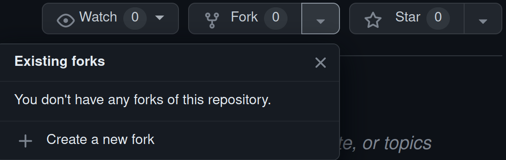
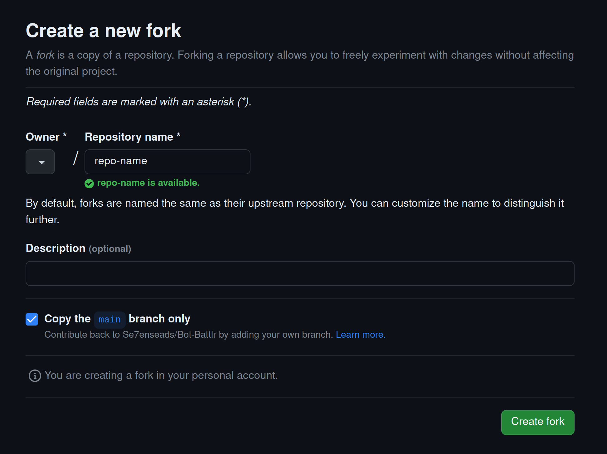
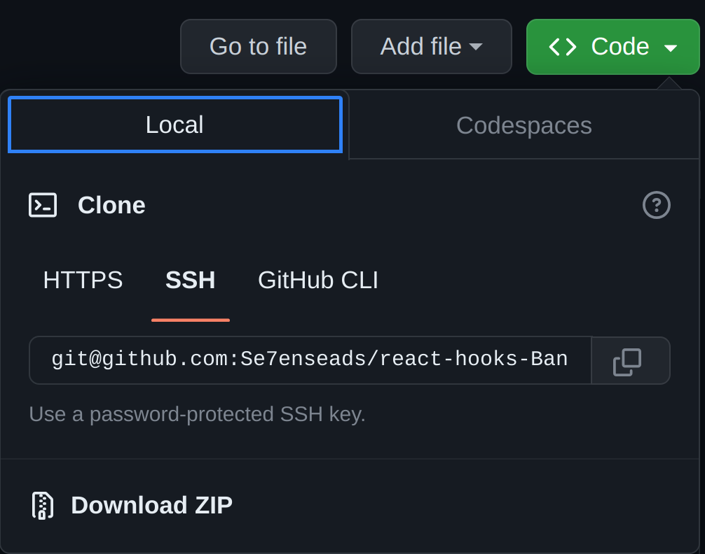

# Python week 3 code challenge

## Table of Contents

- [Getting Started](#🚀-getting-started)
- [Pre-requisites](#pre-requisites)
- [Usage](#usage)
- [License](#📝-license)

## Pre-requisites

To run this program you need:

- [Code Editor/ IDE](#ide)
- [Python](#python)
- [GIT](#git)

### Python

First you need to check if you have python already installed (some OS come with python installed already) run either command:

```bash
python --version
python3 --version
```

If you don't have python installed follow this [tutorial](https://www.linuxcapable.com/how-to-install-python-3-11-on-ubuntu-linux/) for ubuntu or this for [tutorial](https://www.linuxcapable.com/how-to-install-python-3-11-on-linux-mint/) for linux mint.

### IDE

An [IDE](https://www.codecademy.com/article/what-is-an-ide) is short for Integrated Development Environment is a software helps programmers develop software code efficiently.

Popular Python IDEs include:

- [Visual Studio Code (VSCode)](https://code.visualstudio.com/) - [Installation](https://www.linuxcapable.com/install-visual-studio-code-on-ubuntu-linux/). (Recommended)
- [Pycharm Community](https://www.jetbrains.com/pycharm/) - [Installation](https://www.linuxcapable.com/how-to-install-pycharm-on-ubuntu-linux/).
- [Programiz](https://www.programiz.com/python-programming) - Online IDE.

### GIT

Before proceeding, make sure to [download](https://github.com/Se7enseads/python-p3-code-challenge-3/archive/refs/heads/main.zip) or to `clone` the project files onto your machine in order to run the project.

To `clone` this repo ensure you have [Git](https://git-scm.com/) installed onto your local machine.

To check if git is already installed, run this command in your terminal:

```bash
git --version
```

To install Git run this command in the `Terminal`

```bash
sudo apt install git
```

### Clone using https

```bash
git clone https://github.com/Se7enseads/python-p3-code-challenge-3
```

### Clone using SSH

To use [SSH](https://docs.github.com/en/authentication/connecting-to-github-with-ssh) you first need to [fork](https://docs.github.com/en/get-started/quickstart/fork-a-repo) this repo onto your github account.

To fork this repo click the drop down button or arrow next to the name `fork` and then click on `create a new fork` or click this [link](https://github.com/Se7enseads/python-p3-code-challenge-3/fork) to direct you to the forking page.

Click on `Create Fork` to fork.





After forking the repo, click on the drop down arrow next to the `green code button`, select the `SSH option` and copy the code provided.



```bash
git@github.com:[Your-username]/[repo]
```

For more information about git you can checkout the git [documentation.](https://git-scm.com/docs)

## Usage

Access the code from the cloned directory and launch it using Visual Studio Code or VScode. To run this code efficiently:

1. Install the Python extensions in the extensions tab found on the left side of vscode or by pressing `Ctrl + Shift + X`. and install the first one by `ms-python`.
2. Install `Code Runner` extension by using the method above by searching code runner by `formulahendry`.
3. In the setting.json file add the following line:

```json
"code-runner.executorMap": {
    "python": "python3"
  },
```

To run the code click the play icon on the top right or `Ctrl + Shift + N`.

1. To run the tests click on the testing tab on the left.
2. Click on the fast forward button next to the word testing and vscode should run all tests.

## 📝 License

Copyright &copy; 2023 [Kyle Mututo.](https://github.com/Se7enseads)

This project is [MIT](LICENSE) licensed.

[👆 Back to Top](#python-code-challenge)
